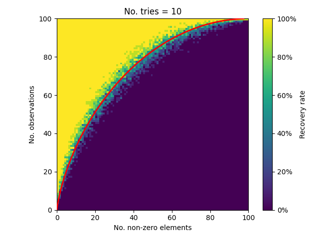

# bpadmm

This is a Python library that implements a solver for the Compressed Sensing on underdetermined linear systems.
The algorithm is based on the Basis Pursuit (BP) with Alternating Direction Method of Multipliers (ADMM).

## Methodologies

Basis pursuit problem is defined as following sparse modeling:

```
minimize |x|_1
    x
subject to y = Ax
```

ADMM solves this problem by the following iterations:

```Python
# This is required once before iteration.
A1 = A^T(A A^T)^(-1)  # pseudo inverse

while not converged:
    x = z - u + A1 @ (y - A @ (z - u))
    z = soft_threshold(x + u, threshold)
    u += x - z
```

Methodologies are briefly explained in [doc/intro_cs.ipynb](doc/intro_cs.ipynb).

## Installation 

### Dependencies

- [jax](https://docs.jax.dev/en/latest/index.html)
- [numpy](https://pypi.org/project/numpy/)
- [tqdm](https://pypi.org/project/tqdm/)

Tests also need [matplotlib](https://pypi.org/project/matplotlib/) and [antarrlib](https://github.com/taishi-hashimoto/python-antarrlib).

Optionally, you can setup GPUs if you have graphic cards to speed up the calculation.  
Please refer to the [installation guide here](./INSTALL.md).

### Installation

Use pip:

```
pip install .
```

## Usage

Import `bpadmm` Python package.

```Python

from bpadmm import basis_pursuit_admm

# n: The number of measurements in A.
# p: The number of parameters in A.
# k: The number of batches (snapshots).
# A: 2-d matrix with the size (n, p).
# y: 2-d matrix with the size (k, n).
# x: 2-d matrix with the size (k, n).

result = basis_pursuit_admm(
    A,  # Observation matrix.
    y,  # Measurement.
    threshold,  # Soft threshold.
)

# Suboptimal solusion
x = result.x

```

### Notes for multi-GPU environment

If your environment has multiple different GPUs, JAX can fail to load the same
kernel onto different kind of devices.  
In that case, specify target devices like this:

```python
import os
os.environ["CUDA_VISIBLE_DEVICES"] = "0,1"
```

## Examples

You can find some more examples under [test](./test) directory.

### Recovery rate 

The number of non-zero elements vs. observations have a tradeoff for the perfect recovery rate of the original signal.
This test tries to reproduce this characteristic curve with a very simple setting; a Gaussian random observation matrices and Gaussian random original signals.

- [test/recovery_rate.py](test/recovery_rate.py)



### Sparse modeling example in radar imaging

- [test/radar_imaging.py](test/radar_imaging.py)  

|Nonadaptive beamforming                       |Sparse modeling                         |
|----------------------------------------------|----------------------------------------|
|||
