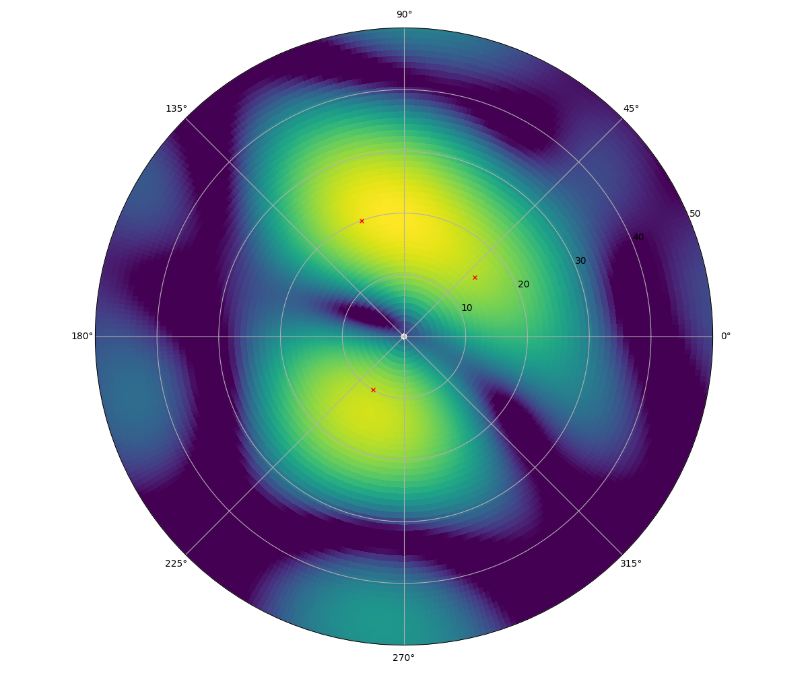
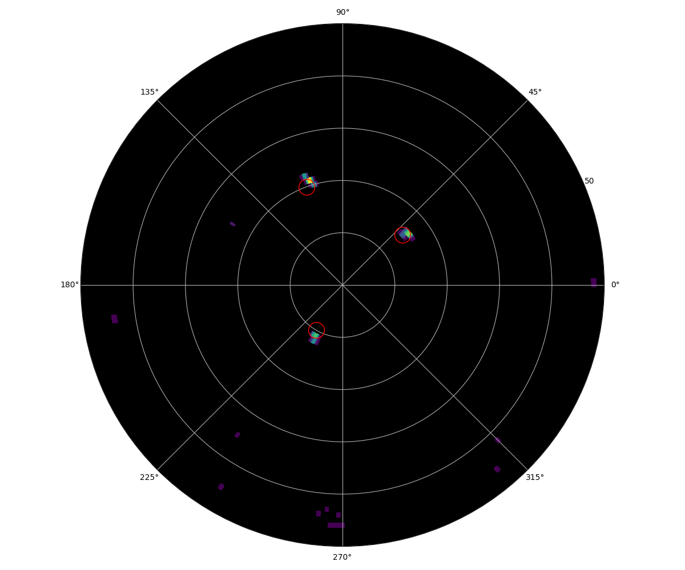

# bpadmm

This is a Python/Rust library that implements a solver for the Compressed Sensing on underdetermined linear systems. It is based on the Basis Pursuit with Alternating Direction Method of Multipliers (BP-ADMM).

Methodologies are briefly explained in [doc/intro_cs.ipynb](doc/intro_cs.ipynb).

## Installation 

### Dependencies

- numpy
- [Rust](https://www.rust-lang.org/tools/install)
- [maturin](https://github.com/PyO3/maturin)
- [openblas](https://github.com/OpenMathLib/OpenBLAS)

Tests also need [tqdm](https://github.com/tqdm/tqdm), matplotlib and [antarrlib](https://github.com/taishi-hashimoto/python-antarrlib).

### Installation

Use `maturin` to build Rust lib, and `pip` to install Python frontend.

```
maturin build --release
pip install .
```

## Usage

Import `bpadmm` Python package.

```Python

from bpadmm import basis_pursuit_admm

# n: The number of measurements in a single snapshot.
# p: The number of parameters in A.
# k: The number of snapshots.
# A: 2-d matrix with the size (n, p).
# y: 2-d matrix with the size (n, k).
# x: 2-d matrix with the size (n, k).

x, info = basis_pursuit_admm(
    A,  # Observation matrix.
    y,  # Observation (measurement).
    threshold,  # Soft threshold.
    # ... and some optional arguments ...
    info=True,
)

```

## Examples

You can find some more examples under [test](./test) directory.

#### Sparse modeling example in radar imaging

- [test/test_radar_imaging.py](test/test_radar_imaging.py)  

|Nonadaptive beamforming                       |Sparse modeling                         |
|----------------------------------------------|----------------------------------------|
|||


